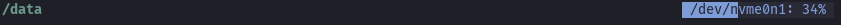

# fs-usage.yazi

A [Yazi](https://github.com/sxyazi/yazi) plugin to show the current partition's used space in the header or status.




## Installation

> [!IMPORTANT]
>
> - This plugin is only supported on Linux (uses `df`)
>   - It *might* work with WSL, but that is untested
> - Requires Yazi v25.5.31 or later

Install with `ya`:

```sh
ya pkg add walldmtd/fs-usage
```

## Usage

To use the default setup, add this somewhere in `~/.config/yazi/init.lua`:

```lua
require("fs-usage"):setup()
```

To customize it, add this instead and adjust/remove the options as needed:

```lua
require("fs-usage"):setup({
    -- All values are optional

    -- Position of the component
    --   parent: Parent component ("Header" or "Status")
    --   align: Anchor point within parent object ("LEFT" or "RIGHT")
    --   order: Order relative to others in the same parent
    -- Default: { parent = "Header", align = "RIGHT", order = 2000 }
    position = { parent = "Header", align = "RIGHT", order = 2000 },

    -- Text format
    -- One of:
    --   "both": Partition name and percent used
    --   "name": Only partition name
    --   "usage": Only percent used
    -- Default: "both"
    format = "both",

    -- Option to enable or disable the usage bar
    -- Default: true
    bar = true,

    -- Percent usage to use the warning style (-1 to disable)
    -- Default: 90
    warning_threshold = 90,

    -- For style options, any unset options use the progress bar style
    --   from the Yazi flavor if available, otherwise it falls back to
    --   the default Yazi style.

    -- Label text style
    --   fg: Text colour (String like "white", or hex like "#ffffff")
    --      (Can also be "" to use the reverse of the bar colour)
    --   bold: Make the label bold (bool)
    --   italic: Make the label italic (bool)
    -- Example: style_label = { fg = "", bold = true, italic = false },
    -- Default: {}
    style_label = {},

    -- Usage bar style
    --   fg: Bar colour (String like "blue", or hex like "#0000ff")
    --   bg: Bar background colour (Same format as fg)
    -- Example: style_normal = { fg = "blue", bg = "black" },
    -- Default: {}
    style_normal = {},

    -- Usage bar style when the used space is above the warning threshold
    -- Options are the same as style_normal
    -- Default: {}
    style_warning = {},

    -- Bar padding
    --   open: Character on the left (string)
    --   close: Character on the right (string)
    -- Example: { open = "█", close = "█" } for square corners,
    --   or { open = "", close = "" } for no padding
    -- Default: { open = "", close = "" }
    padding = { open = "", close = "" }
})
```
